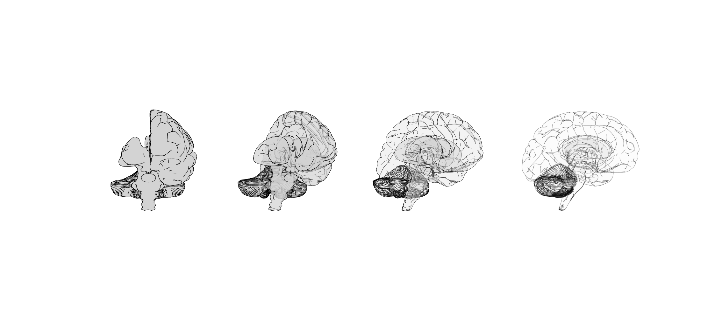

# Introduction


## Welcome to the `brainrender` docs

**`brainrender` is a python package for the visualization of three dimensional neuro-anatomical data. It can be used to render data from publicly available data set \(e.g. Allen Brain atlas\) as well as user generated experimental data. The goal of `brainrender` is to facilitate the exploration and dissemination of neuro-anatomical data by providing a user-friendly platform to create high-quality 3D renderings.**

### For the impatient

If you've read enough and want to dive right in, good news: you can get started creating `brainrender` scenes with two commands!

With a `python < 3.8` environemnt active [install](installation/installation.md) `brainrender` with:

```text
pip install brainrender
```

Then create your first [scene](usage/scene.md) with:

```text
brainrender TH
```

Read on to learn more about `brainrender` and [how to use it,](usage/overview/) including how to create `Scenes` directly from your terminal. 

### 

### A few more details

While developing `brainrender` we aimed to create a flexible and easy-to-use tool for the neuroscience community to use for all their rendering needs.

For this reason:

* we've build upon \(brainglobe\)\[LINK MISSING\]'s atlas API, ensuring that you can use `brainrender` to visualize data from a [wide range of species](usage/atlas.md). 
* we've created a simple and intuitive interface to download and render data from [publicly available](usage/public.md) datasets like the Allen Mouse Connectome and Janelia's Mouse Light projects.
* we've built [a ton of functionality](usage/user.md) into `brainrender` to ensure that we can cover all of your visualization needs \(e.g. see these [images](overview/gallery.md) and [examples](overview/examples.md)\). If we missed something or you'd like to see a new feature added, get in touch on [github](https://github.com/BrancoLab/BrainRender)!
* we're using [`vedo`](https://github.com/marcomusy/vedo), a powerful vtk-based rendering package in python. `vedo`'s flexibility ensures that you can render in `brainrender` any 3d design you can put into a `.obj` or `.stl` file. It's therefore easier than ever to add your custom experimental implant to the renderings. 


Read on on to learn how to [install](installation/installation.md) and [use](usage/overview/) `brainrender`.



### Getting in touch

For any question, issue or bug report you can [get in touch](info/get-in-touch.md) on [the github repo](https://github.com/BrancoLab/BrainRender) or on [twitter](https://twitter.com/Federico_claudi).


