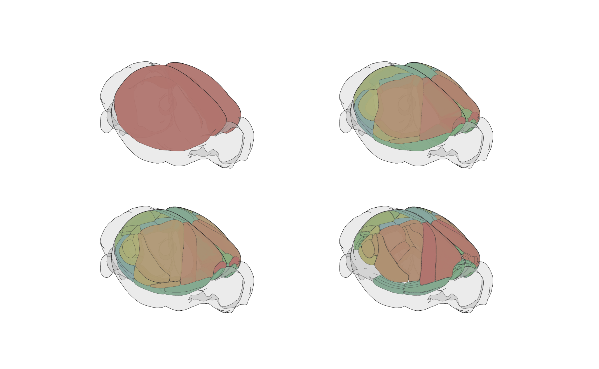

# Introduction

## Welcome to the `brainrender` docs

 brainrender is a python package for the visualization of three dimensional neuroanatomical data. It can be used to render data from publicly available dataset \(e.g. Allen Brain atlas\) as well as user generated experimental data. The goal of brainrender is to faciliate the exploration and dissemination of neuroanatomical data by providing a user-friendly platform to create high-quality 3D renderings.

When developing `brainrender` we aimed to create a flexible and easy-to-use tool for the neuroscience community to use for all their rendering needs.

For this reason:

* we've build upon \(brainglobe\)\[linkmissing\]'s atlas API, ensuring that you can use `brainrender` to visualise data from a wide range of species. 
* we've created a simple and intuitive interface to download and render data from publicly available datasets like the Allen Mouse Connectome and Janelia's Mouse Light projects.
* we've built a ton of functionality into `brainrender` to ensure that we can cover all of your visualisation needs. If we missed something, and you'd like to see a new feature added, get in touch on [github](https://github.com/BrancoLab/BrainRender)!
* we're using `vedo`, a powerful `vtk`-based rendering package in python. `vedo`'s flexibility ensures that you can render in brainrender any 3d object you can put into a `.obj` or `.stl` file. It's therefore easier than ever to add your custom experimental implant to the renderings. 

