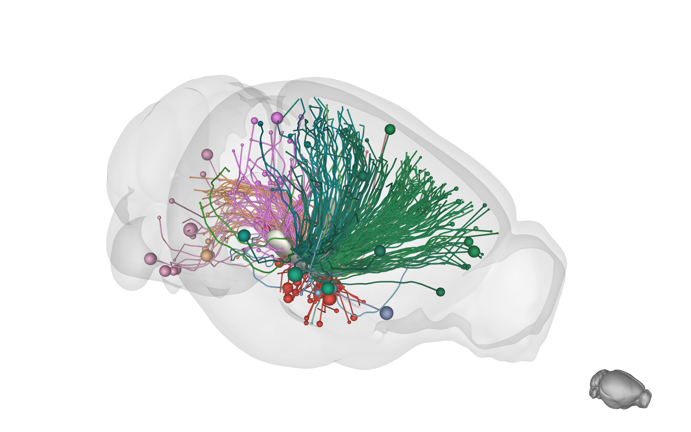
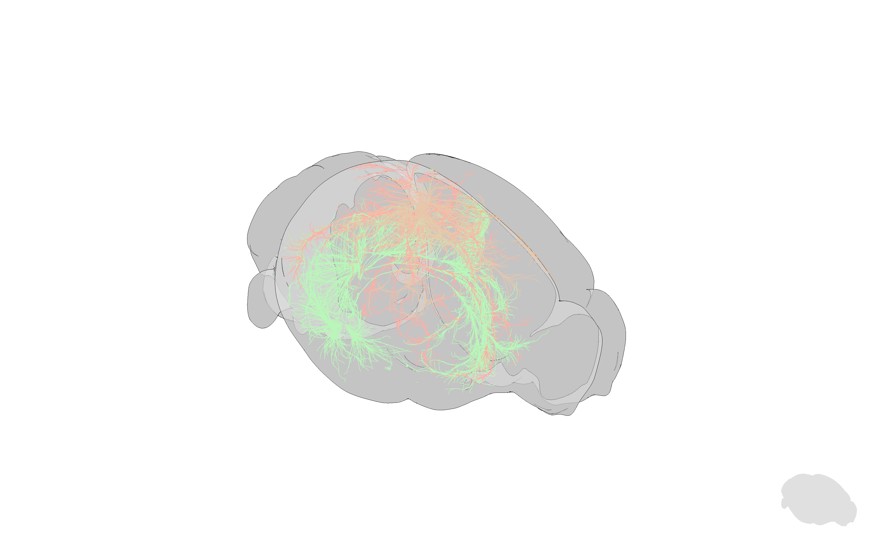
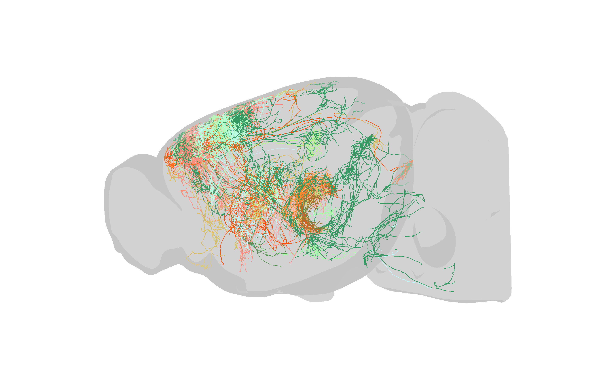

# Publicly available datasets

There's some amazing open-science datasets of neuro-atomy out there. You can use them to learn more about your favorite brain region, to plan new experiment or to corroborate the findings of experiments you've already performed. However often interaction with these datasets requires either:

* using dedicated software that comes with the data. 
  * **pros**:  no programming required 
  * **cons:** little room for personalizing renderings and no easy way to integrate with your own data
* learning how to use an API to download the data you need.
  * **pros**: all the flexibility you need
  * **cons:** often requires a time-consuming learning phase \(for each dataset\) and considerable coding skills. 

`brainrender` brings the best of both options together by giving you the **flexibility** of the APIs with a easy to use interface which requires minimal coding skills.


**Note:** all publicly available datasets currently supported are based on the Allen Institute atlas of the mouse brain. If you know of a cool data set for a different species that you would like to see supported by `brainrender,` [get in touch](../info/get-in-touch.md)!


## Allen Institute Data

`brainrender` can be used to visualize data from many awesome data sets generated from the Allen Institute \([https://brain-map.org/api/index.html](https://brain-map.org/api/index.html)\). This include the Mouse Brain Atlas, and the Mouse Connectome projects among others. All credit for this data go to the Allen Institute and the Allen Institute's contribution should be acknowledged in any work using this data.

> © 2015 Allen Institute for Brain Science. Allen Brain Atlas API

### Neuroanatomy

`brainrender` relies on [brainglobe's Atlas API](https://github.com/brainglobe/bg-atlasapi) to get the 3d morphology of brain regions in the mouse atlas \([and others](atlas.md)\). You can use this functionality to render brain regions in your `Scene` which makes contextualizing any other data you might be visualizing easier than ever. 

Head over to the [examples](../overview/examples.md) to see how to implement this in your `Scene`.

### Volumetric gene expression

The Allen measured the spatialized expression levels of many genes in the mouse. They provide a 3d image for each gene showing the expression levels throughout the brain with a resolution of 200µm per voxel.

`brainrender` let's you easily download and visualize the expression levels for your favorite genes:

Head over to the [examples](../overview/examples.md) to see how to implement this in your `Scene`.

### Mouse connectome

As part of the Mouse Connectome project the Allen Institute performed over 1000 injections of anterogradely transported viruses expressing fluorescent proteins. They then measured fluorescence level throughout the entire brain and registered the data to the Allen atlas. `brainrender` let's you download and visualize the results of these experiments by rendering tracts showing projections to and from brain regions. This can be done in two ways: `tractography` lets you visualize projections **to** a brain region \(afferent projections\) and `streamlines` lets you visualize projections **from** a brain region \(efferent projections\). 

Head hover [here](atlas.md#mouse-specific) to learn more about how to download and render this data, or check the [examples](../overview/examples.md). 

#### Tractography

#### Streamlines

## MouseLight project

As part of the [MouseLight project](https://www.janelia.org/project-team/mouselight) Janelia Campus reconstructed the 3d morphology of over 1000 neurons in the murine brain and registered the data to the Allen Brain. `brainrender` lets you [download](atlas.md#get_neurons) and visualize these neuronal morphologies alongside all other source of anatomical data for the mouse brain.

Head over to the [examples](../overview/examples.md) to see how to implement this in your `Scene`.

