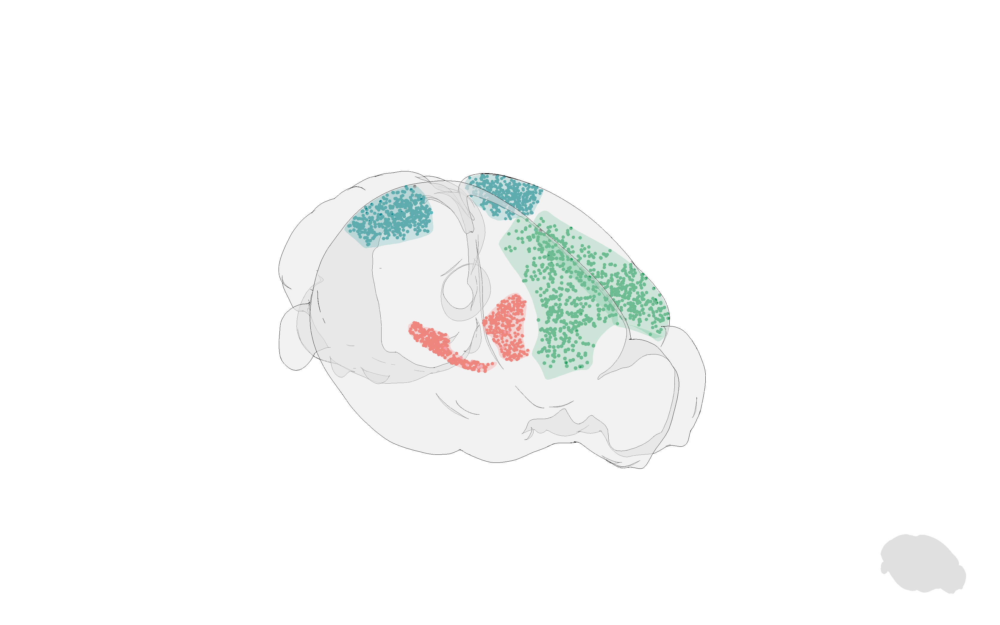
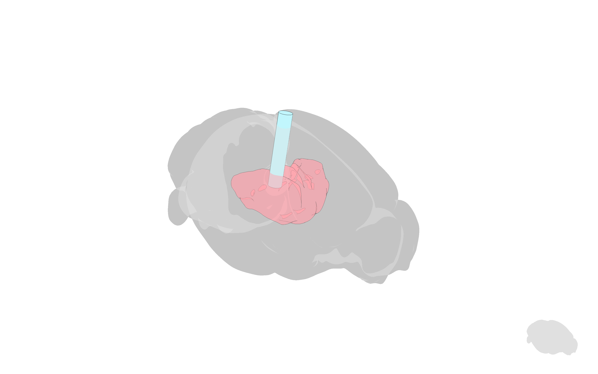
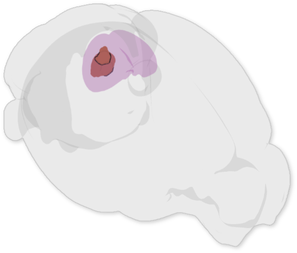

# User-generated data

> That's great, you've done most of the work. You've done your experiment and run the analysis, now you just want to make a good rendering of your data. Fortunately that's the easy \(and fun\) part!

You have your data, and you want to crate some `actors` in your `Scene` to visualize them. How exactly you will do this depends what kind of data are you trying to visualize. The good news is that `brainrender` allows you to simultaneously visualize data from different individuals \(and even different sources if you use [publicly available data](public.md)\), thus facilitating comparisons across experiments. We've tried to implement enough methods to cover common visualization needs, but if you spot something missing to let us know! We are always happy to add new functionality.

As an example of how `brainrender` can be used to visualize experimental data. Below is the location of 20 neuropixels probe inserted in the brain of several mice from [**Steinmetz et al. 2019**](https://figshare.com/articles/Dataset_from_Steinmetz_et_al_2019/9598406) ****\[the code to generate this figure is [here](https://github.com/FedeClaudi/brainrenderscenes/blob/master/scenes/Steinmetz_probes.py)\]**:**

### Visualizing the location of labelled cells

You've done some tracing experiment and extracted the location of labelled cells registered to a brain atlas \(e.g. using tools like [cellfinder](https://docs.cellfinder.info/)\). You can easily visualize the location of labelled cells relative to the rest of the `Atlas` in `brainrender`.

To do so you can simply use `Scene.add_cells` or `Scene.add_cells_from_file`. All it takes is passing the coordinates of each cell and this function will render a sphere at each cell's location. You can specify how the cells should look, color them according to the brain region they're in or, if your data set includes metadata, color them according to some metadata value. 

Have a look at the [examples](../overview/examples.md) to see how you can implement this.

### Visualizing the location of an implanted optic fiber or probe

You have implanted a device in the brain \(e.g. a probe or optic fiber\) and you were able to reconstruct it's location relative to a reference atlas \(e.g. with tools like [neuro](https://github.com/sainsburywellcomecentre/neuro)\), now it's time to create a rendering from it. 

If you know the location of the implanted object, simply use `Scene.add_optic_cannula` to add a colored cylinder showing where the implant was. 

If you've used the Cortex Lab's [SHARPTRACK](https://github.com/cortex-lab/allenCCF/tree/master/SHARP-Track) tool to reconstruct the location of a neuropixel probe implanted in a mouse, we have a function for that too! You can use `Scene.add_probe_from_sharptrack` to visualize the location of the implanted probe. 

![Example visualization of a neuropixel probe \[data courtesy of Cortex Lab\]](../.gitbook/assets/neuropixel.png)

Have a look at the [examples](../overview/examples.md) to see how you can implement this.

### Visualizing the extent of an injection site

Following the injection of a virus or other marker you were able to reconstruct the extention of the injection syte registered to an atlas' reference frame \(e.g. with tools like [neuro](https://github.com/sainsburywellcomecentre/neuro)\). You can simply render this in `brainrender` by saving the mesh of the injection site as an `.obj` file and using `Scene.add_from_file` to load it into your `Scene`. 

Have a look at the [examples](../overview/examples.md) to see how you can implement this.

